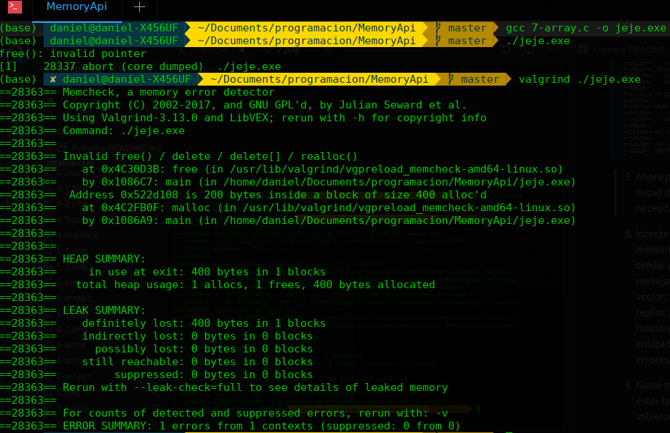
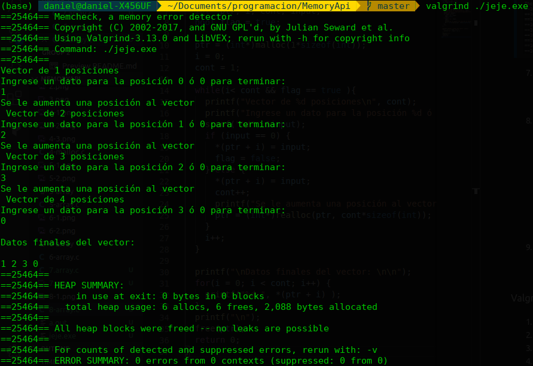

# Memory API # 

En este laboratorio ganará algún grado de familiaridad con la asignación de memoria (memory allocation). Para el caso, usted escribirá algunos programas con bugs. Luego, usará algunas herramientas para localizar los bugs que usted ha insertado. De este modo se familiarizará con algunas de estas herramientas para un uso futuro. Estas herramientas son: el debuger (**gdb**) y el memory-bug detector (**valgrind**).

## Actividades previas ##
Antes de empezar el laboratorio se recomienda (de manera opcional) realizar las siguientes tareas:
1. Revisar los conceptos de **memoria dinamica** vistos previamente si no los recuerta puede acceder al siguiente [enlace](https://github.com/dannymrock/UdeA-SO-Lab/blob/master/lab0/lab0b/parte5/memoria_dinamica.ipynb) en el cual se encuentra la teoria. 
2. En la pagina del laboratorio se recolecto información sobre las herramientas [gdb](https://github.com/dannymrock/UdeA-SO-Lab/tree/master/lab2/herramientas/gdb) y [valgrind](https://github.com/dannymrock/UdeA-SO-Lab/tree/master/lab2/herramientas/valgrind), es muy basica pero mirarla y analizarla antes del laboratorio le puede ser de mucha ayuda.
3. Revise y trate de entender que hacen los siguientes códigos (teniendo en cuenta la teoria vista en malloc):

**Codigo 1**:

```C
#define NULL 0

int main() {
  int *p = (int*)malloc(5*sizeof(int));
  int array[] = {1,2,3,4,5};
  printf("sizeof(p): %d\n",sizeof(p));
  printf("sizeof(p): %d\n",sizeof(*p));
  printf("sizeof(p): %d\n",sizeof(array));
  free(p);
  p = NULL;
  return 0;
}
```
Enlace para [simular](http://www.pythontutor.com/c.html#code=%23define%20NULL%200%0A%0Aint%20main%28%29%20%7B%0A%20%20int%20*p%20%3D%20%28int*%29malloc%285*sizeof%28int%29%29%3B%0A%20%20int%20array%5B%5D%20%3D%20%7B1,2,3,4,5%7D%3B%0A%20%20printf%28%22sizeof%28p%29%3A%20%25d%5Cn%22,sizeof%28p%29%29%3B%0A%20%20printf%28%22sizeof%28p%29%3A%20%25d%5Cn%22,sizeof%28*p%29%29%3B%0A%20%20printf%28%22sizeof%28p%29%3A%20%25d%5Cn%22,sizeof%28array%29%29%3B%0A%20%20free%28p%29%3B%0A%20%20p%20%3D%20NULL%3B%0A%20%20return%200%3B%0A%7D&curInstr=0&mode=display&origin=opt-frontend.js&py=c&rawInputLstJSON=%5B%5D).

**Codigo 2**:

```C
#define NULL 0

int main() {  
  int *p[2];
  int **q = p;
  int a[] = {1,2,3};
  int b[] = {4,5,6,7};
  p[0] = &a[0];
  p[1] = b;
  *(p[0] + 2) = -1;
  *(p[1] + 1) = 3;
  *(*p + 1) = 10;
  *(*(p + 1) + 3) = -7;
  *(*q + 1) = **q + *(*q + 2);  
  q = q + 1;
  *(*q + 1) = *(*q + 3) + *(*q + 2);  
  return 0;
}
```
Enlace para [simular](http://www.pythontutor.com/c.html#code=%23define%20NULL%200%0A%0Aint%20main%28%29%20%7B%20%20%0A%20%20int%20*p%5B2%5D%3B%0A%20%20int%20**q%20%3D%20p%3B%0A%20%20int%20a%5B%5D%20%3D%20%7B1,2,3%7D%3B%0A%20%20int%20b%5B%5D%20%3D%20%7B4,5,6,7%7D%3B%0A%20%20p%5B0%5D%20%3D%20%26a%5B0%5D%3B%0A%20%20p%5B1%5D%20%3D%20b%3B%0A%20%20*%28p%5B0%5D%20%2B%202%29%20%3D%20-1%3B%0A%20%20*%28p%5B1%5D%20%2B%201%29%20%3D%203%3B%0A%20%20*%28*p%20%2B%201%29%20%3D%2010%3B%0A%20%20*%28*%28p%20%2B%201%29%20%2B%203%29%20%3D%20-7%3B%0A%20%20*%28*q%20%2B%201%29%20%3D%20**q%20%2B%20*%28*q%20%2B%202%29%3B%20%20%0A%20%20q%20%3D%20q%20%2B%201%3B%0A%20%20*%28*q%20%2B%201%29%20%3D%20*%28*q%20%2B%203%29%20%2B%20*%28*q%20%2B%202%29%3B%20%20%0A%20%20return%200%3B%0A%7D&curInstr=0&mode=display&origin=opt-frontend.js&py=c&rawInputLstJSON=%5B%5D).

**Codigo 3**:

```C
#define NULL 0

int main() {  
  // Reserva de memoria
  int **p = (int *)malloc(2*sizeof(int *));
  *p = (int)malloc(3*sizeof(int));
  *(p + 1) = (int)malloc(5*sizeof(int));
  
  // Manipulando la memoria reservada
  int i;
  for(i = 0; i < 3; i++) {
    *(*p + i) = 2*i;
  }
  for(i = 0; i < 5; i++) {
    if (i%2 == 0) {
      *(*(p + 1) + i) = -i;
    }
    else {
      *(*(p + 1) + i) = 0;      
    }
  }
  
  
  // Liberacion de memoria
  free(*p);
  free(*(p + 1));
  free(p);
  p = NULL;
  return 0;
}
```
Enlace para [simular](http://www.pythontutor.com/c.html#code=%23define%20NULL%200%0A%0Aint%20main%28%29%20%7B%20%20%0A%20%20//%20Reserva%20de%20memoria%0A%20%20int%20**p%20%3D%20%28int%20*%29malloc%282*sizeof%28int%20*%29%29%3B%0A%20%20*p%20%3D%20%28int%29malloc%283*sizeof%28int%29%29%3B%0A%20%20*%28p%20%2B%201%29%20%3D%20%28int%29malloc%285*sizeof%28int%29%29%3B%0A%20%20%0A%20%20//%20Manipulando%20la%20memoria%20reservada%0A%20%20int%20i%3B%0A%20%20for%28i%20%3D%200%3B%20i%20%3C%203%3B%20i%2B%2B%29%20%7B%0A%20%20%20%20*%28*p%20%2B%20i%29%20%3D%202*i%3B%0A%20%20%7D%0A%20%20for%28i%20%3D%200%3B%20i%20%3C%205%3B%20i%2B%2B%29%20%7B%0A%20%20%20%20if%20%28i%252%20%3D%3D%200%29%20%7B%0A%20%20%20%20%20%20*%28*%28p%20%2B%201%29%20%2B%20i%29%20%3D%20-i%3B%0A%20%20%20%20%7D%0A%20%20%20%20else%20%7B%0A%20%20%20%20%20%20*%28*%28p%20%2B%201%29%20%2B%20i%29%20%3D%200%3B%20%20%20%20%20%20%0A%20%20%20%20%7D%0A%20%20%20%20%20%20%0A%20%20%7D%0A%20%20%0A%20%20%0A%20%20//%20Liberacion%20de%20memoria%0A%20%20free%28*p%29%3B%0A%20%20free%28*%28p%20%2B%201%29%29%3B%0A%20%20free%28p%29%3B%0A%20%20p%20%3D%20NULL%3B%0A%20%20%0A%20%20return%200%3B%0A%7D&curInstr=0&mode=display&origin=opt-frontend.js&py=c&rawInputLstJSON=%5B%5D)

## Actividades de laboratorio ##

1. Escriba un programa simple llamado ```null.c``` que cree un puntero a un entero, llevelo a null y entonces intente desreferenciarlo (esto es, asignarle un valor). Compile este programa llamado ```null```. ¿Qué pasa cuando usted ejecuta este programa?

  >Nos aparece la siguiente excepción ```Segmentation fault (core dumped)```
  >Ya que estamos accediendo a una posición de memoria que no existe o no tenemos acceso.
  

2. Compile el programa del ejercicio anterior usando información de simbolos (con la flag -g). Al hacer esto se esta poniendo mas informacion en el ejecutable para permitir al debugger acceder a informacion util sobre los nombres de las variables y cosas similares. Ejecute el programa bajo el debugger digitando en consola (para el caso) ```gdb null``` y entonces una vez el ```gdb``` este corriendo ejecute ```run```. ¿Qué muestra gdb?

  >Starting program: /home/breakermoob/Escritorio/memory-api/null
  >Program received signal SIGSEGV, Segmentation fault.
  >strchrnul () at ../sysdeps/x86_64/strchr.S:32
  >32      ../sysdeps/x86_64/strchr.S: No such file or directory.

  

3. Haga uso de la herramienta ```valgrind``` en el programa empleado en los puntos anteriores. Se usará la herramienta ```memcheck``` que es parte de ```valgrind``` para analizar lo que pasa: ```valgrind --leak-check=yes null```. ¿Qué pasa cuando corre esto?, ¿Puede usted interpretar la salida de la herramienta anterior?

  >En la siguiente imagen con ayuda de valgrind podemos ver que no se esta asignando memoria y por eso al asignar el valor entero tenemos problemas.
  

4. Escriba un programa sencillo que asigne memoria usando ```malloc()``` pero olvide liberarla antes de que el programa termina. ¿Qué pasa cuando este programa se ejecuta?, ¿Puede usted usar gdb para encontrar problemas como este?, ¿Que dice acerca de Valgrind (de nuevo use este con la bandera ```--leak check=yes```)?

  >Nuestro programa corre sin problema alguno
  

  >No es posible, ya que gdb no posee esta función.
  

  >Con Valgrind si es posible utilizando la bandera --leak-check=full o --leak-check=yes. Como vemos en la siguiente figura ```definitely lost: 20 bytes in 1 blocks```
  

5. Escriba un programa que cree un array de enteros llamado data de un tamaño de 100 usando ```malloc```; entonces, lleve el ```data[100]``` a ```0```. ¿Qué pasa cuando este programa se ejecuta?, ¿Qué pasa cuando se corre el programa usando ```valgrind```?, ¿El programa es correcto?

  >Cuando ejecutamos el programa se ejecuta normalmente, asigna memoria y hace los cambios que necesitemos en el array.
  

  >Si usamos Valgrind podemos observar que desperdiciamos toda esa memoria.
  

  >El funcionamiento del programa es de cirta forma correcto, ya que logra terminar su ejecución si problema, pero esta perdida de memoria es mejor no dejarla en nuestro codigo. El uso de Valgrind nos ayuda a detectar estos problemas.

6. Codifique un programa que asigne un array de enteros (como arriba), luego lo libere, y entonces intente imprimir el valor de un elemento del array. ¿El programa corre?, ¿Que pasa cuando hace uso de ```valgrind```?

  >Si ejecutamos nuestro programa notamos que corre de forma normal, agregamos un print antes y despues de liberar la memoria; El resultado para el despues es muy interesante, ya que da un valor totalmente diferente.
  

  >Si lo hacemos con valgrind, podemos ver que nos muestra los problemas de memoria que tenemos mientras que no se haga el free, al realizar el free no hace esta advertencia. Y em ambos print el valor es 0.
  

7. Ahora pase un **funny value** para liberar (e.g. un puntero en la mitad del array que usted ha asignado) ¿Qué pasa?, ¿Ústed necesita herramientas para encontrar este tipo de problemas?

Sucede un error al intentar liberar el puntero en la mitad del arreglo porque es un espacio de memoria que se encuentra dentro de otro bloque de memoria asignado, por lo que es necesario hacer un `realloc()` antes de poder liberar la memoria. Al parecer este error no lo detecta el compilador, pero sí se puede dar en tiempo de ejecución. No son necesarias herramientas extra para encontrarlo, pero sí son de gran ayuda para hacer un mejor debug. Por ejemplo, `valgrind` indica que se está intentando liberar 200 bytes dentro de un bloque de tamaño 400, dando una gran pista de cuál es el problema.


8. Intente usar alguna de las otras interfaces para asignacion de memoria. Por ejemplo, cree una estructura de datos simple similar a un vector y que use rutinas que usen realloc para manejar el vector. Use un array para almacenar los elementos del vector; cuando un usuario agregue una entrada al vector, use realloc para asignar un espacio mas a este. ¿Que tan bien funciona el vector asi?, ¿Como se compara con una lista enlazada?, utilice ```valgrind``` para ayudarse en la busqueda de errores.

El vector permite agregar y acceder a los elementos de forma correcta. El nivel de complejidad de la estructura no es muy elevado, pero sí requiere de varias acciones y variables para poder funcionar. De cierta forma, es muy parecido a una lista ligada sencilla, pues permite agregar elementos de manera dinámica y se puede acceder mediante apuntadores, la diferencia es que no se están almacenando nodos ni existen campos ligas para recorrer la estructura, dificultando inserciones al medio y cosas así. `valgrind` no muestra errores relacionados con el manejo de la memoria.




9. Gaste mas tiempo y lea sobre el uso de gdb y valgrind. Conocer estas herramientas es critico; gaste el tiempo y aprenda como volverse un experto debugger en UNIX y C enviroment.


### Valgrind ###

1. http://valgrind.org/docs/manual/quick-start.html
2. http://www.st.ewi.tudelft.nl/koen/ti2725-c/valgrind.pdf
3. http://pages.cs.wisc.edu/~bart/537/valgrind.html
4. http://web.mit.edu/amcp/drg/valgrind-howto.pdf

### GDB ###

1. http://www.lsi.us.es/~javierj/ssoo_ficheros/GuiaGDB.htm
2. https://www.gdb-tutorial.net/
3. https://web.eecs.umich.edu/~sugih/pointers/summary.html
4. https://www.cs.umd.edu/~srhuang/teaching/cmsc212/gdb-tutorial-handout.pdf
5. https://lihuen.linti.unlp.edu.ar/index.php/C%C3%B3mo_usar_GDB
6. https://www.cs.cmu.edu/~gilpin/tutorial/
7. http://pages.di.unipi.it/bodei/CORSO_FP_17/FP/Lezioni/gdb-commands.pdf
8. https://cs.brown.edu/courses/cs033/docs/guides/gdb.pdf
9. https://darkdust.net/files/GDB%20Cheat%20Sheet.pdf
10. http://users.ece.utexas.edu/~adnan/gdb-refcard.pdf
